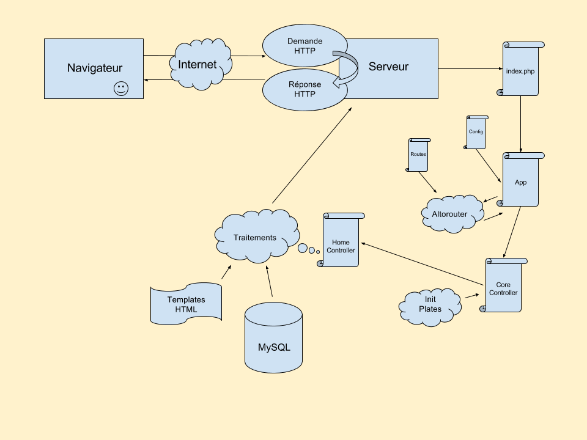

# Révisions architecture PHP

## Objectif

Revoir les notions d'architecture coté serveur : de la requête HTTP jusqu'au rendu retourné par le serveur.

## Client / serveur

0. Un visiteur arrive sur notre site internet
0. Une requête HTTP est créée par son navigateur, il veut voir la *home*
0. La requête appel notre serveur et attend une réponse :zzz:

## Le routing sur notre serveur

0. Grâce à notre `.htaccess`, toutes les requêtes arrivent sur notre fichier `index.php`

<pre>
RewriteEngine on
RewriteCond %{REQUEST_FILENAME} !-f
RewriteCond %{REQUEST_FILENAME} !-d
RewriteRule . index.php [L]</pre>

0. Notre `index.php` charge alors notre application :
<pre>
$app = new App();
$app->run();</pre>

  0. On crée l'instance de classe `App` -> ça exécute le `__construct` :
    - On charge le fichier de config
    - On démarre `Altorouter`
    - On crée nos URLs / routes dans `Altorouter`
<pre>$this->router->map('GET', '/', 'MainController#home', 'home');</pre>

  0. Ca exécute la méthode `run` de notre `App`
    - C'est `Altorouter` qui analyse pour nous l'URL appelée afin de nous dire quelle est la `target` demandée
    <pre>$match = $this->router->match();</pre>

    - On parcours `target` pour définir quel `controller` et quelle `method` appeler

  0. Une fois qu'on sait quel `controller` et `method` appeler, ben on l'appel !

## Création du rendu

La méthode appelée se charge de trouver le bon template à utiliser. Le `controller` initialise la librairie `Plates` pour faciliter la génération du HTML.

<pre>$this->templates = new \League\Plates\Engine('src/templates');</pre>

`Plates` s'occupe de prendre le template demandé et d'insérer, éventuellement, le layout et les partials requis pour contruire toute la page HTML.

<pre>echo $this->templates->render('main/home', ['data' => $data]);</pre>

Le `echo` indique qu'on souhaite écrire dans la réponse que le serveur va retourner à celui qui a fait appel à lui. Comme on ne fait plus rien ensuite, le serveur envoi la réponse au client (le navigateur par exemple) et c'est fini ;)

Lorsque le visiteur change de page, on refait tout le process pour retourner la nouvelle page demandée !

## Pour résumé

